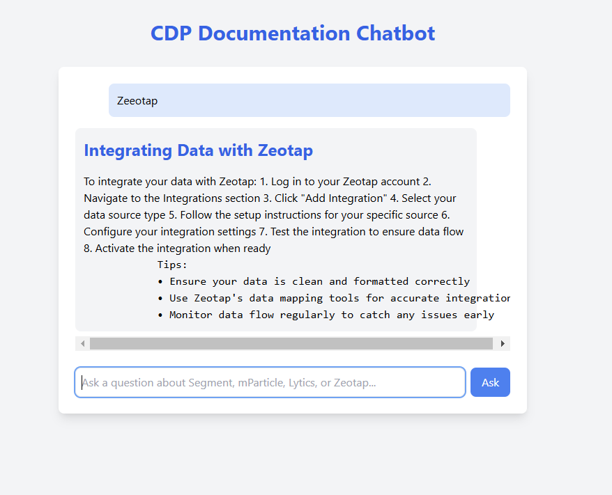
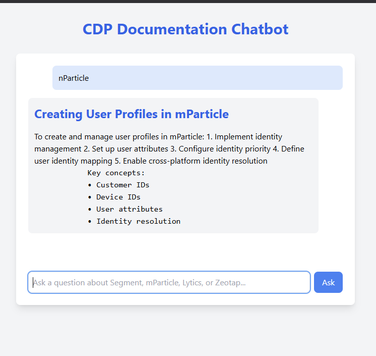
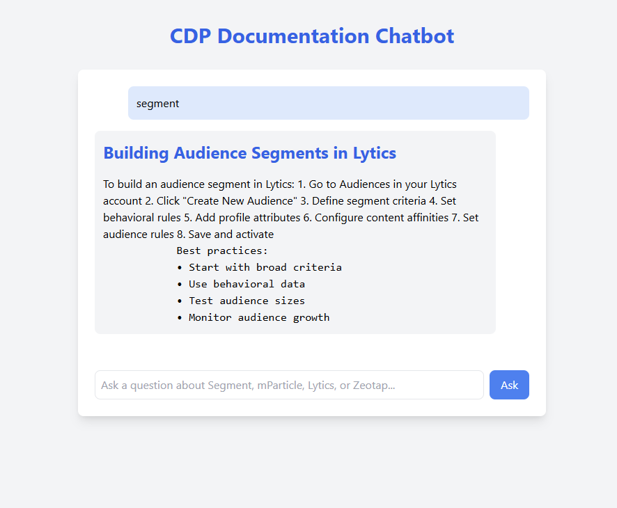
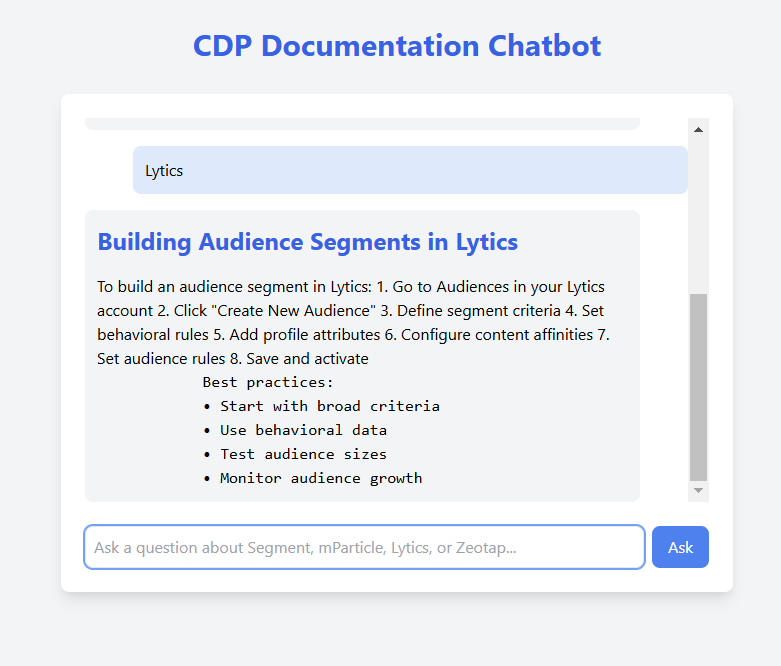

# CDP Documentation Chatbot

## Overview

The CDP Documentation Prototype Chatbot is designed to assist users with "how-to" questions related to four major Customer Data Platforms (CDPs): **Segment**, **mParticle**, **Lytics**, and **Zeotap**. By extracting relevant information from the official documentation of these platforms, the chatbot provides users with step-by-step guidance to accomplish specific tasks.

## Features

- **How-to Guidance**: Offers detailed instructions for common tasks across the supported CDPs.
- **Advanced Configurations**: Provides insights into complex configurations and integrations.
- **Conversational Interface**: Understands natural language queries, facilitating intuitive user interactions.
- **Keyword and Fuzzy Matching**: Utilizes advanced matching techniques to retrieve the most relevant information.

## Installation

1. **Clone the Repository**:

   ```bash
   git clone https://github.com/anurag115/Chatbot-for-CDP.git
   cd Chatbot-for-CDP
   ```

2. **Install Dependencies**:

   ```bash
   pip install -r requirements.txt
   ```

3. **Run the Application**:

   ```bash
   uvicorn app.main:app --reload --host 0.0.0.0 --port 8000
   ```

## Usage

Once the application is running, navigate to `http://localhost:8000` in your browser. You'll be presented with a chat interface where you can ask questions related to any of the supported CDPs. For example: "How do I set up event tracking in Segment?"


## Screenshots

1. **Zeotap**:




1. **mParticle**:


   

1. **Segment**:




1. **Lyctis**:


  


 